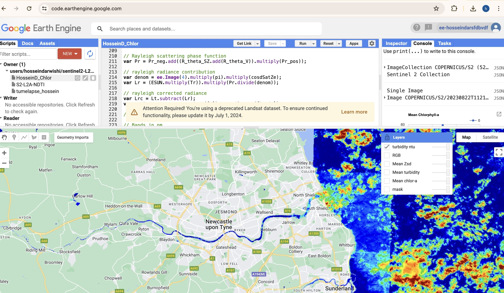

# Water Quality Analysis with Google Earth Engine

This repository contains JavaScript code for conducting water quality analysis using Google Earth Engine (GEE), specifically focusing on turbidity and chlorophyll-a level assessment using Sentinel-2 satellite.

## Overview

Water quality assessment is crucial for understanding the health of aquatic ecosystems. Turbidity and chlorophyll-a level are key indicators of water quality, providing insights into factors such as sedimentation, nutrient loading, and algal blooms. This repository provides JavaScript code snippets and examples to analyze water quality using satellite imagery available on Google Earth Engine.

## Contents

- `GEE-WQ.js`: JavaScript code for estimating turbidity chlorophyll-a level using satellite imagery.
- `README.md`: This file providing an overview of the repository and instructions for usage.

## Getting Started

To use the scripts in this repository, follow these steps:

1. **Set Up Google Earth Engine Account**: If you don't have one already, sign up for a Google Earth Engine account at [https://earthengine.google.com/](https://earthengine.google.com/).

2. **Install Google Earth Engine API**: Install the Google Earth Engine API following the instructions provided in the [official documentation](https://developers.google.com/earth-engine/guides/python_install).

3. **Clone the Repository**: Clone this repository to your local machine using the following command:
git clone https://github.com/h777d/Google-Earth-Engine-water-quality-analysis.git

4. **Run the Script**: Open the JavaScript file (`GEE-WQ.js`) in the GEE code editor and run it. Follow the instructions provided within the script for parameter settings and data selection.

Ensure you have adequate satellite imagery selected for your study area and time period before running the scripts. Adjust parameters such as region of interest, date range, and sensor bands according to your analysis requirements.

